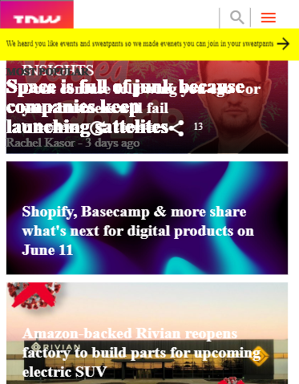
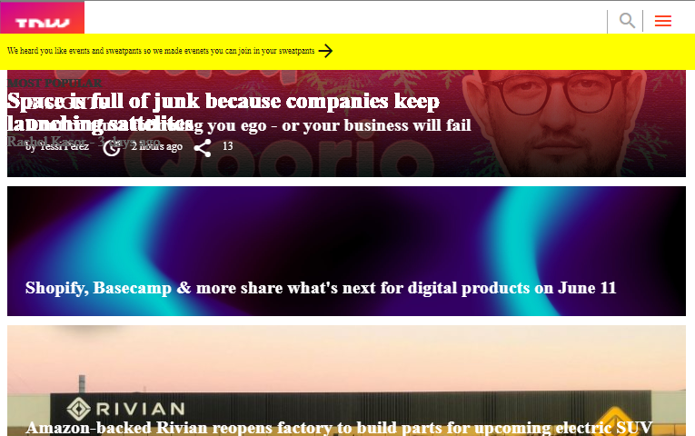
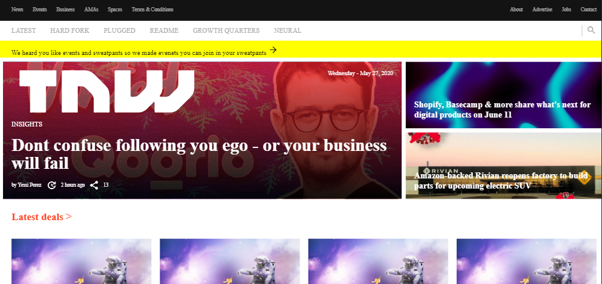

# Project 6 - Building with Responsive Design

This is an assigned collaborative project where we had to build a responsive webpage for three different screen sizes:

 - Mobile screen size
 - Tablet screen size
 - Laptop/Desktop screen size. 

 We are cloning the <a href="https://thenextweb.com/">The Next Web </a> website. It is a clone in terms of layout and its responsiveness.

## Preview of webpage

### Mobile screen size



### Tablet screen size



### Laptop/Desktop screen size



## Built With

- HTML5
- CSS3
- CSS3 Media Queries
- <a href="https://fontawesome.com/">Font Awesome</a>
- <a href="https://materializecss.com/icons.html">Google icons</a>

## Live Demo

[Live Demo Link](https://the-next-web.now.sh/)


## Getting Started


To get a local copy up and running follow these simple example steps.

## How To Use 🔧

From your command line, first clone the project:

```bash
# Clone this repository
$ git clone https://github.com/paulzay/The-next-web

# Go into the repository/directory
$ cd The-next-web

$ run live server

```

## Authors

👤 **Paul Ogolla**

- Github: [@paulzay](https://github.com/paulzay)
- Twitter: [@_paulzay](https://twitter.com/_paulzay_)
- Linkedin: [Paul Ogolla](https://www.linkedin.com/in/paulogolla/)

👤 **Losalini Rokocakau**

- Github: [@chelmerrox](https://github.com/chelmerrox)
- Twitter: [@chelmerrox](https://twitter.com/chelmerrox)
- Linkedin: [Losalini Rokocakau](https://linkedin.com/losalini-rokocakau)

## 🤝 Contributing

Contributions, issues and feature requests are welcome!

Feel free to check the [issues page](https://github.com/paulzay/The-next-web/issues).

## Show your support

Give a ⭐️ if you like this project!

## Acknowledgments

- Special thanks to Microverse and the Odin Project
- Our Stand-Up Team members
- Microverse TSEs

## 📝 License

This project is [MIT](lic.url) licensed.
